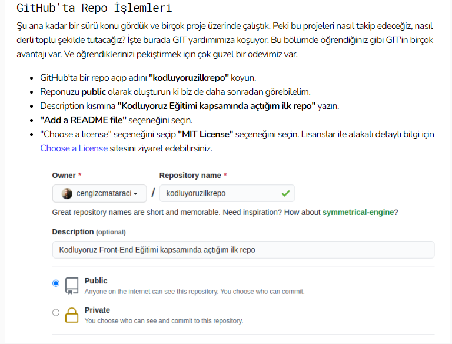

# Kodluyoruz İlk Repo


Bu repo [Kodluyoruz](https://www.kodluyoruz.org/) Front-End Eğitimde oluşturduğumuz ilk repo. İçerisinde bir adet Readme dosyası, bir adet index.html barındıyor.





## Installation
----
Öncelikle preji [repo](https://github.com/ooktsl/kodluyoruzilkrepo.git)'dan clonelayın.

```
git clone https://github.com/yunusaydinn/kodluyoruzilkrepo.git
```

## Usage
***
Projeyi cloneladıktan sonra Visual Studio Code programında açınız.

Linux için:
```
cd kodluyoruzilkrepo
code .
```

## Contributing
***
Pull requestler kabul edilir. Büyük değişiklikler için, lütfen önce neyi değiştirmek istediğinizi tartışmak için bir konu açınız.

## License
---
[MIT](https://choosealicense.com/licenses/mit/)


